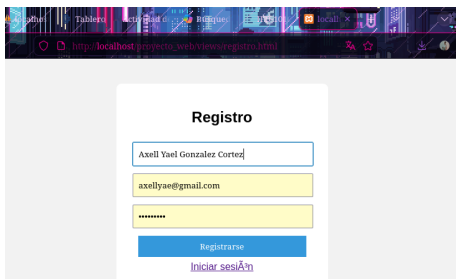
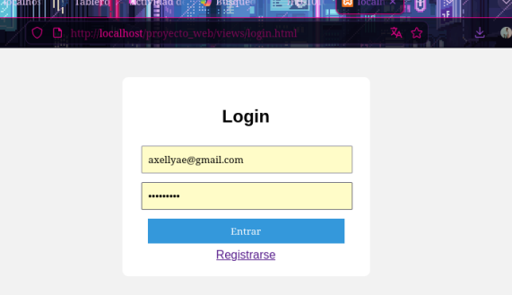
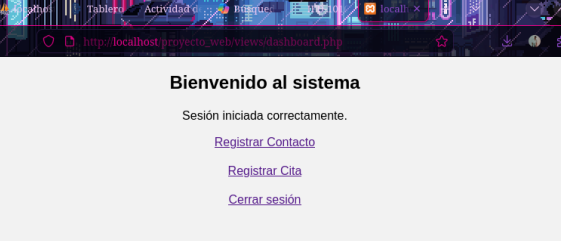
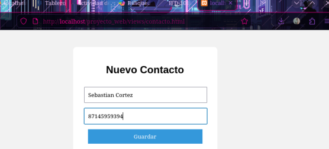
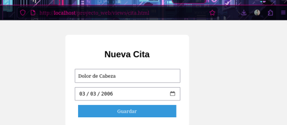
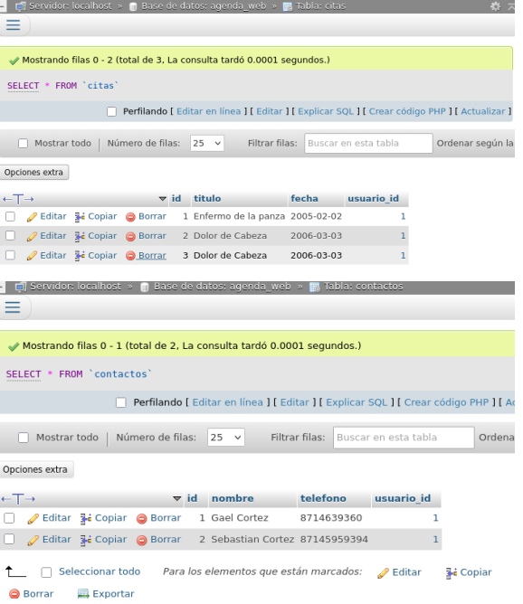

# Proyecto 1: Agenda Web

## Objetivo del Proyecto

Desarrollar una aplicación web que permita a los usuarios registrar y administrar contactos y citas personales de forma organizada mediante una base de datos relacional y una interfaz accesible desde el navegador web.

## Problema que Resuelve

Muchas personas necesitan llevar un control de sus contactos y compromisos diarios. Este sistema permite almacenar y consultar dicha información de manera digital, facilitando su administración y reduciendo el riesgo de pérdida de información.

## Tecnologías Utilizadas

* PHP
* HTML5
* CSS3
* JavaScript
* MySQL
* phpMyAdmin
* XAMPP

## Conceptos Aplicados

* Desarrollo web dinámico.
* Programación del lado del servidor.
* Bases de datos relacionales.
* CRUD (Crear, Leer, Actualizar y Eliminar).
* Formularios web.
* Manejo de sesiones.
* Conexión entre PHP y MySQL.
* Diseño de interfaces web.

## Descripción del Funcionamiento

La aplicación permite que los usuarios creen una cuenta e inicien sesión para acceder al sistema. Una vez autenticados, pueden registrar contactos y administrar citas asociadas a su cuenta.

La información se almacena en una base de datos MySQL, permitiendo realizar operaciones de consulta, inserción, actualización y eliminación de registros. El sistema cuenta con formularios para capturar la información y páginas dinámicas desarrolladas en PHP para procesar los datos.

## Estructura General del Proyecto

* Registro de usuarios.
* Inicio de sesión.
* Gestión de contactos.
* Gestión de citas.
* Base de datos relacional.
* Panel principal de administración.

## Capturas de Pantalla

### Registro de Usuario



### Inicio de Sesión



### Menú Principal



### Gestión de Contactos



### Gestión de Citas



### Base de Datos



## Instrucciones de Ejecución

1. Instalar XAMPP.
2. Iniciar Apache y MySQL.
3. Crear la base de datos correspondiente en phpMyAdmin.
4. Importar el archivo SQL del proyecto.
5. Copiar la carpeta del sistema dentro de la carpeta `htdocs`.
6. Abrir el navegador web.
7. Acceder mediante la dirección:

```
http://localhost/AgendaWeb
```

## Dificultades Encontradas

Durante el desarrollo se presentaron dificultades relacionadas con la conexión entre PHP y MySQL, el diseño de la base de datos y la validación de formularios. También fue necesario realizar pruebas para verificar el correcto funcionamiento de las operaciones CRUD.

## Soluciones Implementadas

Se configuró correctamente la conexión con la base de datos, se diseñaron tablas relacionadas para almacenar la información y se implementaron validaciones básicas para garantizar la integridad de los datos ingresados por el usuario.

## Reflexión Personal

### ¿Qué aprendí?

Aprendí a desarrollar una aplicación web dinámica utilizando PHP y MySQL, así como a diseñar bases de datos y conectarlas con una interfaz web funcional.

### ¿Qué fue lo más difícil?

La implementación de la conexión entre PHP y MySQL y la organización de las relaciones entre las tablas de la base de datos.

### ¿Qué mejoraría?

Mejoraría el diseño visual de la aplicación, agregaría más validaciones de seguridad y desarrollaría nuevas funcionalidades para una mejor experiencia de usuario.
