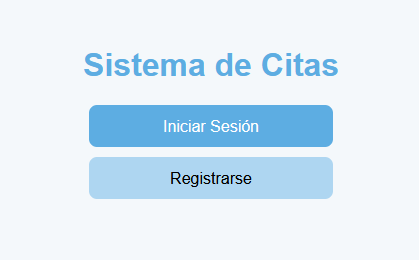
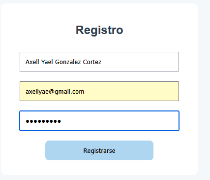
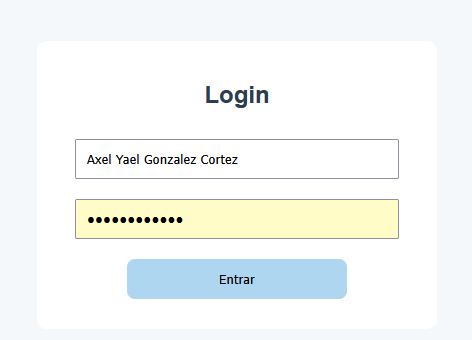
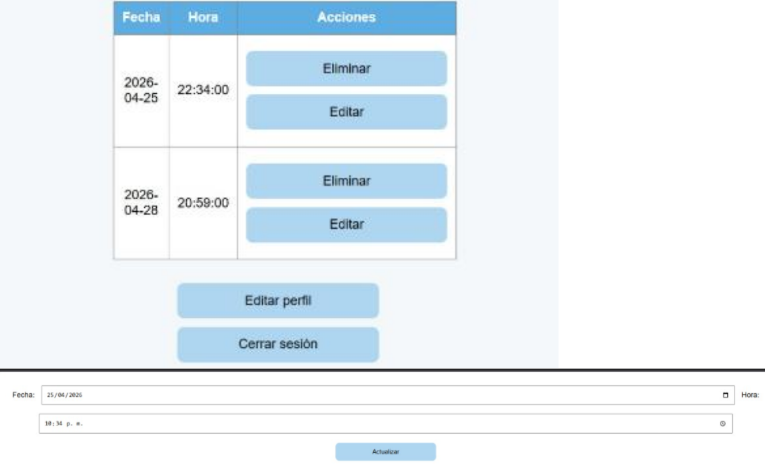

# Proyecto 2: Sistema Web de Gestión de Citas

## Objetivo del Proyecto

Desarrollar un sistema web para la administración de citas que permita registrar usuarios y gestionar información mediante operaciones de inserción, consulta, actualización y eliminación de registros utilizando una base de datos relacional.

## Problema que Resuelve

En muchos negocios y organizaciones es necesario llevar un control de las citas programadas. Este sistema facilita la administración de dicha información mediante una plataforma web que permite almacenar y consultar los datos de forma organizada y eficiente.

## Tecnologías Utilizadas

* PHP
* HTML5
* CSS3
* JavaScript
* MySQL
* phpMyAdmin
* XAMPP

## Conceptos Aplicados

* Arquitectura MVC (Modelo Vista Controlador).
* Programación orientada al desarrollo web.
* CRUD (Crear, Leer, Actualizar y Eliminar).
* Conexión a bases de datos MySQL.
* Formularios web.
* Validación de datos.
* Manejo de sesiones.
* Organización modular del código.

## Descripción del Funcionamiento

El sistema permite registrar usuarios y administrar citas mediante una interfaz web amigable. Los datos son almacenados en una base de datos MySQL y pueden ser consultados, modificados o eliminados según las necesidades del usuario.

La aplicación se encuentra organizada bajo una estructura MVC, separando la lógica de negocio, la presentación y el acceso a los datos para facilitar el mantenimiento y escalabilidad del sistema.

## Estructura General del Proyecto

* Registro de usuarios.
* Inicio de sesión.
* Gestión de citas.
* Operaciones CRUD.
* Base de datos relacional.
* Interfaz web dinámica.

## Capturas de Pantalla

### Página Principal

### Registro de Usuario

### Inicio de Sesión

### Gestión de Citas

### Base de Datos

## Instrucciones de Ejecución

1. Instalar XAMPP.
2. Iniciar Apache y MySQL.
3. Crear la base de datos del sistema.
4. Importar el archivo SQL correspondiente.
5. Copiar el proyecto dentro de la carpeta `htdocs`.
6. Abrir el navegador web.
7. Acceder mediante la dirección correspondiente del proyecto.

## Dificultades Encontradas

Durante el desarrollo fue necesario diseñar correctamente la estructura de la base de datos y establecer la comunicación entre las diferentes capas del sistema. También se realizaron pruebas para garantizar el correcto funcionamiento de las operaciones CRUD.

## Soluciones Implementadas

Se implementó una estructura organizada basada en MVC, permitiendo separar responsabilidades dentro del sistema. Además, se optimizó la conexión con la base de datos y se verificó el correcto funcionamiento de cada módulo mediante pruebas de ejecución.

## Reflexión Personal

### ¿Qué aprendí?

Aprendí a desarrollar una aplicación web utilizando una estructura más organizada mediante el patrón MVC, así como a implementar operaciones CRUD conectadas a una base de datos MySQL.

### ¿Qué fue lo más difícil?

La organización del proyecto bajo una arquitectura MVC y la correcta comunicación entre las vistas, controladores y la base de datos.

### ¿Qué mejoraría?

Mejoraría la interfaz gráfica del sistema, agregaría validaciones más robustas y desarrollaría nuevas funcionalidades para optimizar la administración de citas.

