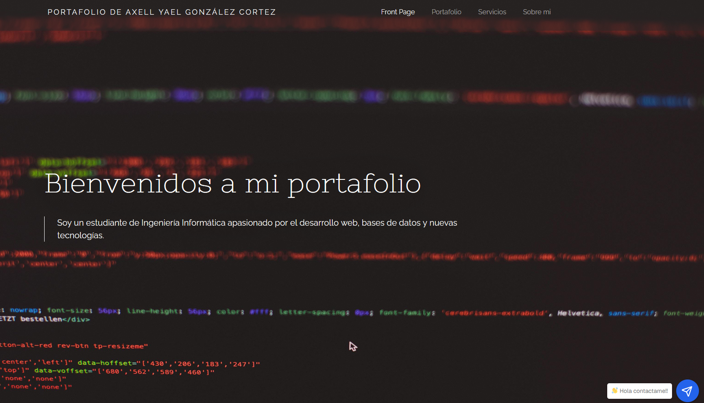
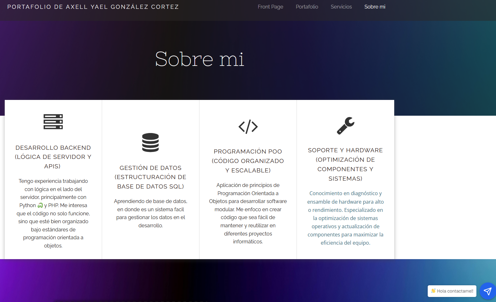
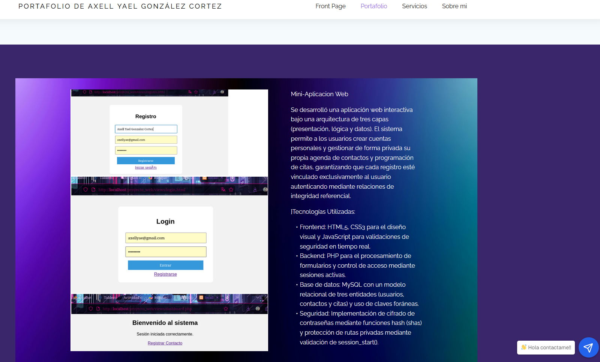
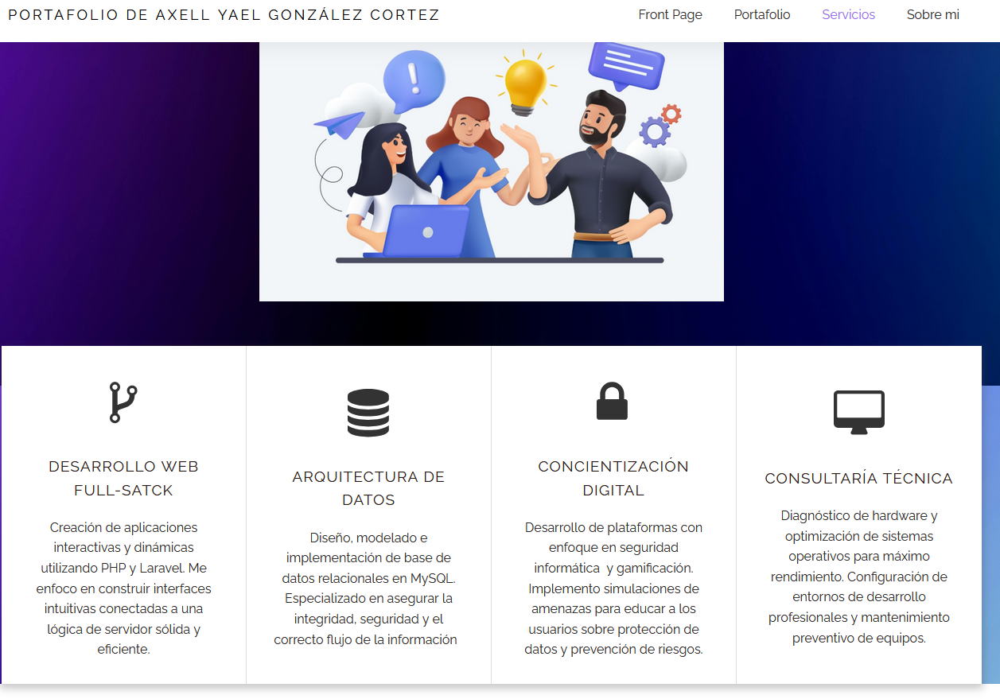

# Proyecto 3: Sitio Web Personal en WordPress

## Objetivo del Proyecto

Desarrollar un sitio web personal utilizando WordPress para presentar información académica, habilidades, proyectos y medios de contacto, aplicando principios de diseño web y gestión de contenido.

## Problema que Resuelve

Permite centralizar información personal, académica y profesional en una plataforma web accesible desde cualquier dispositivo, facilitando la presentación del perfil del estudiante y sus proyectos desarrollados.

## Tecnologías Utilizadas

* WordPress
* HTML5
* CSS3
* Tema Colibri
* XAMPP
* MySQL

## Conceptos Aplicados

* Sistemas de Gestión de Contenidos (CMS).
* Diseño web responsivo.
* Administración de páginas web.
* Personalización de temas.
* Organización de contenido digital.
* Navegación web.

## Descripción del Funcionamiento

El sitio web fue desarrollado utilizando WordPress como plataforma principal. Se diseñaron diferentes secciones para mostrar información personal, académica y profesional, incluyendo páginas como Inicio, Sobre Mí, Portafolio, Servicios y Contacto.

El sistema permite navegar entre las diferentes secciones mediante un menú principal, facilitando el acceso a la información y proporcionando una experiencia de usuario intuitiva.

## Estructura General del Proyecto

* Página de Inicio.
* Página Sobre Mí.
* Portafolio de Proyectos.
* Servicios.
* Formulario de Contacto.
* Menú de Navegación.

## Capturas de Pantalla

### Página de Inicio

### Página Sobre Mí

### Página Portafolio

### Página Servicios

## Instrucciones de Ejecución

1. Instalar WordPress.
2. Configurar la base de datos MySQL.
3. Activar el tema utilizado.
4. Configurar las páginas y menús.
5. Acceder al sitio mediante el navegador web.

## Dificultades Encontradas

Durante el desarrollo fue necesario configurar correctamente las páginas, los menús de navegación y la personalización del tema utilizado para lograr una presentación adecuada del contenido.

## Soluciones Implementadas

Se configuraron correctamente las páginas principales, se organizaron los menús de navegación y se personalizó el diseño para mejorar la experiencia del usuario.

## Reflexión Personal

### ¿Qué aprendí?

Aprendí a utilizar WordPress como sistema gestor de contenidos para desarrollar sitios web de manera rápida y organizada.

### ¿Qué fue lo más difícil?

La configuración de la navegación entre páginas y la personalización de algunos elementos del tema.

### ¿Qué mejoraría?

Agregar más proyectos al portafolio, mejorar el diseño visual y optimizar la versión móvil del sitio web.
